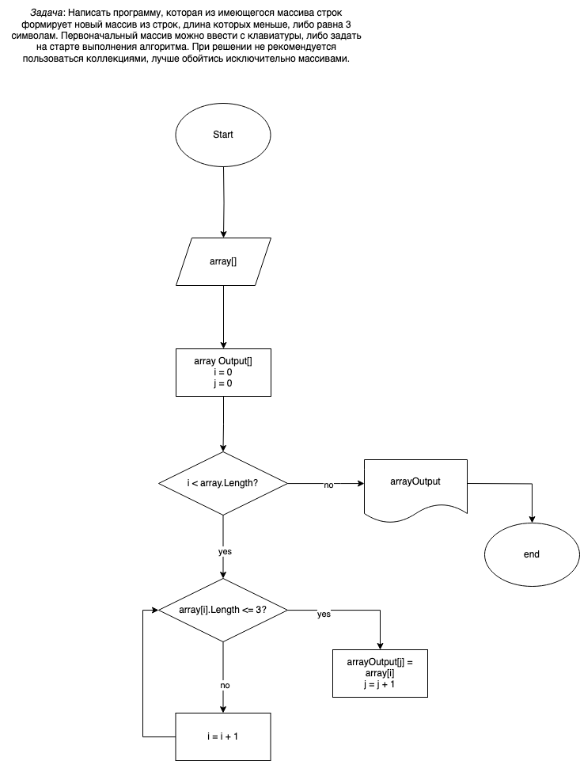

# <b style="color:green">Итоговая контрольная работа по основному блоку VerTask </b>
## Поставленная задача
Задача: Написать программу, которая из имеющегося массива строк 
формирует новый массив из строк, длина которых меньше, либо равна 3 символам. 
Первоначальный массив можно ввести с клавиатуры, либо задать на старте выполнения алгоритма. 
При решении не рекомендуется пользоваться коллекциями, лучше обойтись исключительно массивами.

Примеры:
[“Hello”, “2”, “world”, “:-)”] → [“2”, “:-)”]
[“1234”, “1567”, “-2”, “computer science”] → [“-2”]
[“Russia”, “Denmark”, “Kazan”] → []

## Решение
Программа расположена в папке [VerTask](https://github.com/AliceAlice1995/VerTask/tree/main/VerTask).

**Описание:** Пользователь вводит желаемый размер массива - количество значений, которые введутся на входе. 
Метод CreateAndFillArrayByUser создает массив и запрашивает у пользователя значения вводимых строк. 
После этого в консоль выводится получившийся массив значений и задается параметр stringLength. Он устанавливает значение длины строки
для попадаения в результирующий массив. Программа обращается к методу FilterArrayLessLengthElem и передает исходный массив и параметр stringLength. 
Метод FilterArrayLessLengthElem вызывает метод CountArrayLessLengthElem для подсчета количества элементов, после возвращания 
создается новый массив необходимой длины. 
В результате проверки на указанную длину элементы укладываются в новый массив, после чего результирующий массив выводится в консоль.

Блок-схема программы расположена в папке [FlowChart](https://github.com/AliceAlice1995/VerTask/tree/main/FlowChart).

